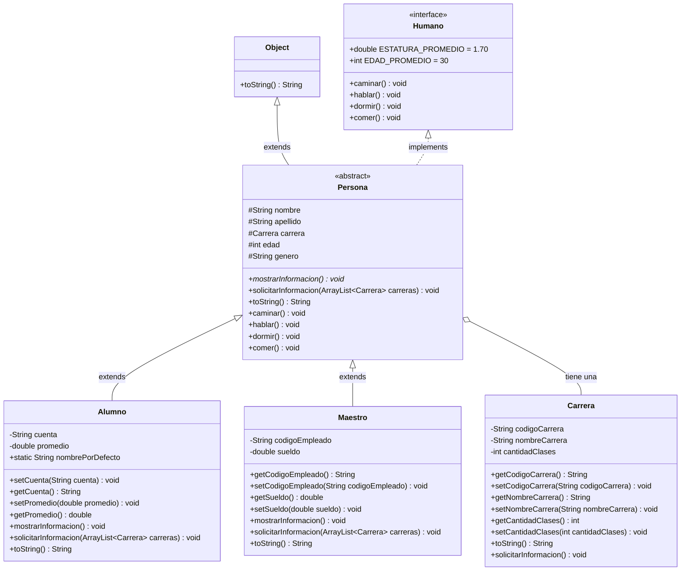

# 📚 Ejercicio de Alumnos — Programación Orientada a Objetos

Proyecto de ejemplo para la clase de **Programación Orientada a Objetos (POO)** — UNAH, I Período 2026.

Este proyecto implementa un sistema de gestión de alumnos, maestros y carreras que ilustra los conceptos fundamentales de la POO en Java: **clases, clases abstractas, interfaces, herencia, polimorfismo y encapsulamiento**.

---

## 📂 Estructura del proyecto

```
src/
├── App.java                  # Clase principal (punto de entrada)
├── clases/
│   ├── Persona.java          # Clase abstracta base
│   ├── Alumno.java           # Clase concreta (hereda de Persona)
│   ├── Maestro.java          # Clase concreta (hereda de Persona)
│   └── Carrera.java          # Clase independiente (POJO)
└── interfaces/
    └── Humano.java           # Interfaz con comportamientos genéricos
```

---

## 🗂️ Jerarquía de clases



---

## 🧩 Conceptos de POO ilustrados en el proyecto

### 1. Clases y Objetos

Una **clase** es una plantilla o molde que define los atributos (datos) y métodos (comportamiento) de un tipo de objeto. Un **objeto** es una instancia concreta de esa clase.

**Ejemplo en el proyecto:** La clase `Carrera` ([src/clases/Carrera.java](src/clases/Carrera.java)) es un **POJO** (*Plain Old Java Object*) que encapsula los datos de una carrera universitaria:

```java
// src/clases/Carrera.java
public class Carrera {
    private String codigoCarrera;
    private String nombreCarrera;
    private int cantidadClases;
    // ...
}
```

En [src/App.java](src/App.java) se crean **objetos** (instancias) de esta clase:

```java
carreras.add(new Carrera("C001", "Ingenieria en Sistemas", 40));
```

---

### 2. Interfaces

Una **interfaz** define un contrato: un conjunto de métodos que las clases que la implementen **deben** cumplir. También puede definir constantes (`static final`). No contiene implementación de los métodos (en su forma básica).

**Ejemplo en el proyecto:** La interfaz `Humano` ([src/interfaces/Humano.java](src/interfaces/Humano.java)) define comportamientos comunes de todo ser humano:

```java
// src/interfaces/Humano.java
public interface Humano {
    public static final double ESTATURA_PROMEDIO = 1.70;
    public static final int EDAD_PROMEDIO = 30;

    public void caminar();
    public void hablar();
    public void dormir();
    public void comer();
}
```

La clase `Persona` implementa esta interfaz y proporciona el cuerpo de cada método:

```java
// src/clases/Persona.java
public abstract class Persona extends Object implements Humano {
    @Override
    public void caminar() {
        System.out.println("La persona esta caminando");
    }
    // ...
}
```

---

### 3. Clases Abstractas

Una **clase abstracta** no puede ser instanciada directamente. Sirve como base para otras clases y puede contener:

- **Métodos concretos** (con implementación).
- **Métodos abstractos** (sin implementación, que las subclases **deben** sobrescribir).

**Ejemplo en el proyecto:** `Persona` ([src/clases/Persona.java](src/clases/Persona.java)) es una clase abstracta. No se puede crear un objeto `new Persona()`, pero sí se puede usar como tipo de referencia:

```java
// src/clases/Persona.java
public abstract class Persona extends Object implements Humano {
    // Método abstracto: las subclases deben implementarlo
    public abstract void mostrarInformacion();
}
```

```java
// src/App.java — No se puede instanciar directamente:
// persona1 = new Persona(); // ❌ Error de compilación

// Pero sí se puede usar como tipo de referencia (polimorfismo):
persona1 = new Alumno("20210001", "Pedro", "Ramirez", null, 20, "Masculino", 8.5); // ✅
```

---

### 4. Herencia

La **herencia** permite crear una nueva clase a partir de una existente, reutilizando sus atributos y métodos. En Java se usa la palabra clave `extends`.

**Ejemplo en el proyecto:** `Alumno` ([src/clases/Alumno.java](src/clases/Alumno.java)) y `Maestro` ([src/clases/Maestro.java](src/clases/Maestro.java)) **heredan** de `Persona`. Esto significa que obtienen automáticamente los atributos `nombre`, `apellido`, `carrera`, `edad` y `genero`, así como todos los métodos de `Persona`.

```java
// src/clases/Alumno.java
public class Alumno extends Persona {
    private String cuenta;
    private double promedio;

    public Alumno(String cuenta, String nombre, String apellido,
                  Carrera carrera, int edad, String genero, double promedio) {
        // Invoca al constructor de Persona para inicializar atributos heredados
        super(nombre, apellido, carrera, edad, genero);
        this.cuenta = cuenta;
        this.promedio = promedio;
    }
}
```

La llamada a `super(...)` invoca el constructor de la clase padre `Persona` y **debe ser la primera línea** del constructor de la subclase.

---

### 5. Encapsulamiento

El **encapsulamiento** consiste en ocultar los detalles internos de una clase y exponer únicamente lo necesario a través de métodos **getters** y **setters**. Los modificadores de acceso controlan la visibilidad:

| Modificador   | Misma clase | Mismo paquete | Subclases | Cualquier clase |
|---------------|:-----------:|:-------------:|:---------:|:---------------:|
| `private`     | ✅          | ❌            | ❌        | ❌              |
| `protected`   | ✅          | ✅            | ✅        | ❌              |
| *(default)*   | ✅          | ✅            | ❌        | ❌              |
| `public`      | ✅          | ✅            | ✅        | ✅              |

**Ejemplo en el proyecto:** Los atributos de `Alumno` son `private` y se acceden mediante getters/setters:

```java
// src/clases/Alumno.java
private String cuenta;
private double promedio;

public void setCuenta(String cuenta) { this.cuenta = cuenta; }
public String getCuenta() { return this.cuenta; }
```

En `Persona`, los atributos son `protected` para que las subclases (`Alumno`, `Maestro`) puedan acceder directamente a ellos:

```java
// src/clases/Persona.java
protected String nombre;
protected String apellido;
```

---

### 6. Polimorfismo

El **polimorfismo** es la capacidad de un objeto de tomar diferentes formas. En Java se manifiesta de dos maneras:

#### a) Sobrescritura de métodos (*Override*)

Consiste en **redefinir** un método heredado de la clase padre para darle un comportamiento diferente en la subclase.

```java
// src/clases/Persona.java — Sobrescribe toString() de Object
@Override
public String toString() {
    return nombre + ',' + apellido + ',' + carrera + ',' + edad + ',' + genero;
}
```

```java
// src/clases/Alumno.java — Sobrescribe toString() de Persona y agrega sus propios datos
@Override
public String toString() {
    return cuenta + ',' + promedio + ',' + super.toString();
}
```

Cada subclase también sobrescribe el método abstracto `mostrarInformacion()` definido en `Persona`, proporcionando su propia implementación.

#### b) Polimorfismo con tipos de referencia

Una variable de tipo padre puede referenciar objetos de sus subclases. El método que se ejecuta depende del **tipo real** del objeto en tiempo de ejecución:

```java
// src/App.java
public void invocarToString(Persona p) {
    System.out.println(p.toString()); // Llama al toString() del tipo real del objeto
}

// Se puede pasar un Alumno, un Maestro o cualquier subclase de Persona:
invocarToString(persona1);         // persona1 es de tipo Alumno
invocarToString(alumno1);          // tipo Alumno
invocarToString(new Maestro(...)); // tipo Maestro
```

> ⚠️ **Nota:** No se puede pasar un objeto `Carrera` a este método porque `Carrera` **no hereda** de `Persona`.

#### c) Wildcards y genéricos

El método `listarPersonas` usa un **wildcard** (`? extends Persona`) para aceptar listas de cualquier subclase de `Persona`:

```java
// src/App.java
public void listarPersonas(ArrayList<? extends Persona> personas, String titulo) {
    // Funciona tanto con ArrayList<Alumno> como con ArrayList<Maestro>
}
```

---

### 7. Asociación / Composición

La **asociación** modela una relación de tipo *"tiene un"* entre clases. `Persona` tiene un atributo de tipo `Carrera`, lo que establece una relación de composición:

```java
// src/clases/Persona.java
protected Carrera carrera; // Una persona "tiene una" carrera
```

Esto se diferencia de la herencia (*"es un"*): un `Alumno` **es una** `Persona`, pero una `Persona` **tiene una** `Carrera`.

---

### 8. Atributos y métodos estáticos

Un atributo `static` pertenece a la **clase** y no a un objeto individual. Se comparte entre todas las instancias y se accede a través del nombre de la clase.

```java
// src/clases/Alumno.java
public static String nombrePorDefecto = "Sin nombre";
// Se accede como: Alumno.nombrePorDefecto (sin necesidad de crear un objeto)
```

---

### 9. Abstracción

La **abstracción** es el proceso de simplificar un objeto complejo, enfocándose solo en los aspectos esenciales e ignorando los detalles innecesarios. En este proyecto, la clase `Persona` abstrae las características comunes de alumnos y maestros (nombre, apellido, edad, etc.), mientras que cada subclase añade únicamente lo específico de su rol (`cuenta` y `promedio` para `Alumno`; `codigoEmpleado` y `sueldo` para `Maestro`).

---

## ▶️ Ejecución

El punto de entrada del programa es el método `main` en [src/App.java](src/App.java):

```java
public static void main(String[] args) throws Exception {
    new App();
}
```

Al ejecutar la aplicación se presenta un menú interactivo (usando `JOptionPane`) que permite:

| Opción | Acción            |
|:------:|-------------------|
| 1      | Agregar alumno    |
| 2      | Agregar maestro   |
| 3      | Agregar carrera   |
| 4      | Listar alumnos    |
| 5      | Listar maestros   |
| 6      | Listar carreras   |
| 0      | Salir             |

---

## 🛠️ Requisitos

- **Java JDK 17** o superior
- Un IDE como **VS Code** con la extensión *Extension Pack for Java*
